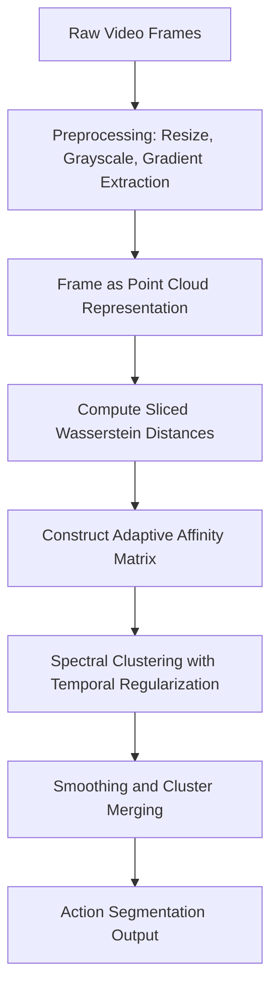

# Unsupervised Action Segmentation using Spectral Clustering and Wasserstein Distance

## Motivation and Application

Automatically segmenting different stages of actions in videos, such as surgical steps, human activities, or robotic motions, is critical for fields like healthcare automation, robot self-supervision, and sports analysis. Manual annotations are expensive and often impractical. This project proposes an unsupervised approach based on Wasserstein distance and spectral clustering to discover distinct action phases without relying on labels.

---

## 1. Dataset Selection and Preparation

### Recommended Dataset
- **Weizmann Human Action Dataset**
- Link: [https://www.wisdom.weizmann.ac.il/~vision/SpaceTimeActions.html](https://www.wisdom.weizmann.ac.il/~vision/SpaceTimeActions.html)
- Characteristics: Low-resolution (180x144), grayscale videos, clean background, each clip contains a single action.

### Preprocessing Steps
1. **Frame Extraction**:
   - Extract frames at 10 FPS (downsample from 25 FPS).
2. **Resize Frames**:
   - Resize to 64x64 pixels using area interpolation.
3. **Grayscale Normalization**:
   - Convert images to grayscale and normalize pixel intensities to [0,1].
4. **Additional Feature Encoding**:
   - Apply Sobel filter to compute local gradient magnitude.
   - Each frame is represented as a 3D point cloud with (x, y, intensity, gradient_strength).

---

## ** 2. Frame Representation (not mentioned before)

Each frame is transformed into a 3D (or 4D) point cloud:
- **x**: Normalized horizontal pixel position.
- **y**: Normalized vertical pixel position.
- **z**: Pixel intensity.
- **Optional Gradient Channel**: Gradient magnitude value.

This representation captures both global appearance and local structural variations.

Why?
- Frame representation turns raw pixels into something closer to structured spatial distributions.

- It bridges the gap between the visual content of a frame and the mathematical operations (Wasserstein, clustering).

- It preserves meaningful relationships inside a frame, enabling later steps like distance computation and clustering to succeed.

---

## 3. Computing Distances Between Frames

### Wasserstein Distance Approximation

#### Sliced Wasserstein Distance (SWD)
- Project the point cloud onto multiple 1D directions.
- Compute 1D Wasserstein distances on each projection.
- Average distances across all projections.

#### Improved Sampling Strategy
- Instead of purely random directions, augment projections using principal component directions (PCA axes) to capture dominant frame structures.

#### Parallelization
- Compute pairwise distances in parallel.
- Cache and exploit symmetry: \( D[i,j] = D[j,i] \).

---

## 4. Affinity Matrix Construction

### Adaptive Local Scaling
- For each point, define a local bandwidth \( \sigma(x_i) \) based on the distance to its k-th nearest neighbor.
- Construct affinity matrix:
  \[
  W(x_i, x_j) = \exp\left(-\frac{D(x_i, x_j)^2}{\sigma(x_i) \sigma(x_j)}\right)
  \]
- Sparsify the graph by keeping only the top-5 nearest neighbors for each node.

---

## 5. Spectral Clustering

### Steps
1. **Graph Laplacian Construction**:
   - Build normalized graph Laplacian from the affinity matrix.
2. **Spectral Embedding**:
   - Perform eigenvalue decomposition.
3. **Cluster Assignment**:
   - Apply k-means clustering to the top eigenvectors.
4. **Temporal Smoothness Regularization**:
   - Add soft penalties in k-means loss to encourage neighboring frames to belong to the same cluster.

---

## 6. Temporal Postprocessing

### Smoothing and Merging
- Apply median filtering (window size=5) to the sequence of frame labels.
- Merge small clusters if the average intra-cluster Wasserstein distance is below a threshold.

---

## Workflow Diagram

---

## Key References
- **Diffusion Maps and Geometric Learning**: [Coifman et al., 2005](https://www.pnas.org/doi/full/10.1073/pnas.0500334102)
- **Spectral Clustering Review**: [von Luxburg, 2007](https://arxiv.org/abs/0711.0189)
- **Wasserstein Distances and Optimal Transport**: [Peyré & Cuturi, 2019](https://arxiv.org/abs/1803.00567)
- **Sliced Wasserstein Distance**: [Rabin et al., 2011](https://hal.science/hal-00635602)

---